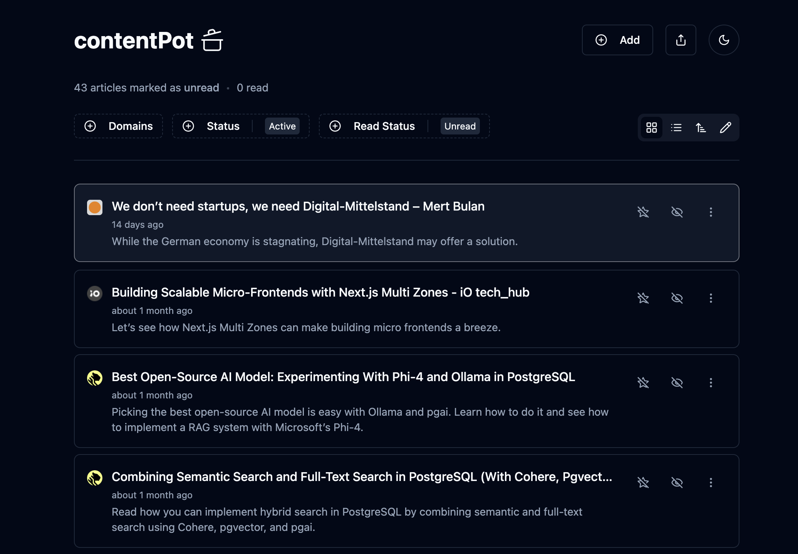

ContentPot is a web application designed for saving and sharing content using a stateless architecture. The app maintains state directly in the browser and enables content sharing through URL-encoded state parameters.

This project demonstrates efficient state management without server dependencies while providing seamless content preservation and distribution capabilities.
